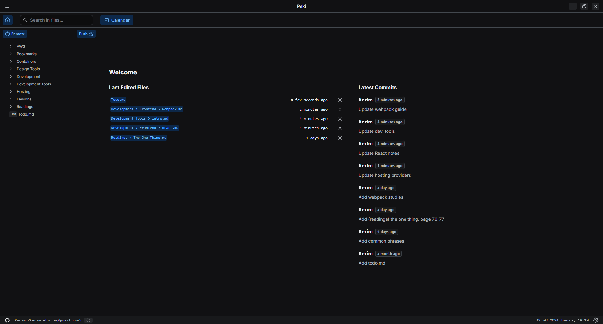
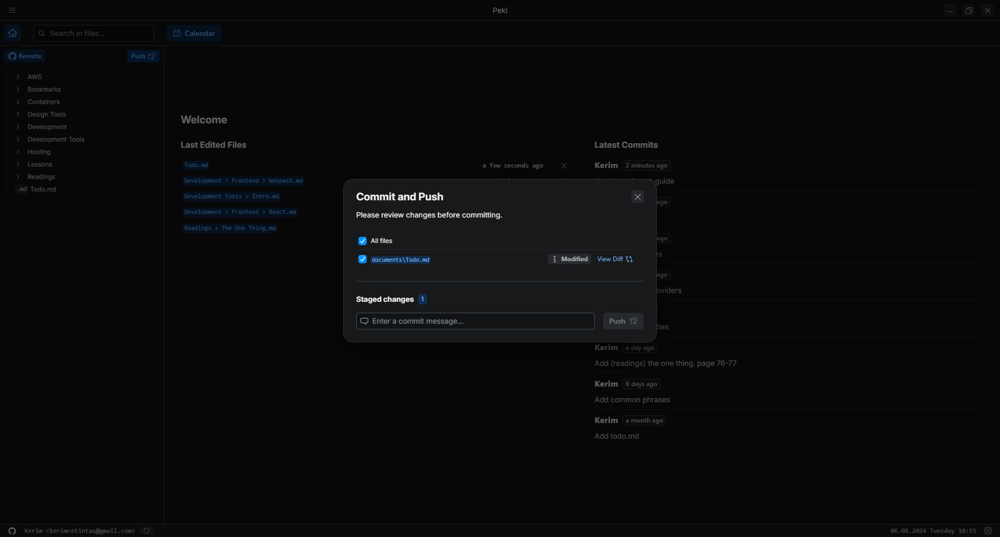

## Open Source

### Desygna

Desygna is a simple, powerful and extensible styling library.
It provides typesafe css-in-js helpers that makes easier to create variant based components.

&nbsp;

## Side Projects

### Peki, a file editor | Manage your workspace with Git integration

[WIP] It is a code editor similar to VSCode. The editor offers a local-first approach, allowing users to edit files offline. It features Git integration, providing users to interact with their repositories directly within the editor.

The editor includes a commit reminder feature to help users keep track of their changes and commit regularly. It also offers a beautiful commit history view via a calendar, making it easy to visualize and navigate through past commits. Additionally, the editor provides syntax highlighting for various programming languages, enhancing the coding experience and readability.

|                             |                             |                             |
| :-------------------------: | :-------------------------: | :-------------------------: |
|  |  |  |
